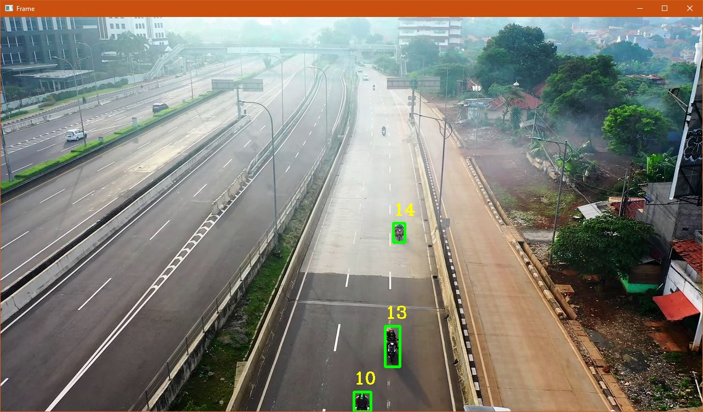
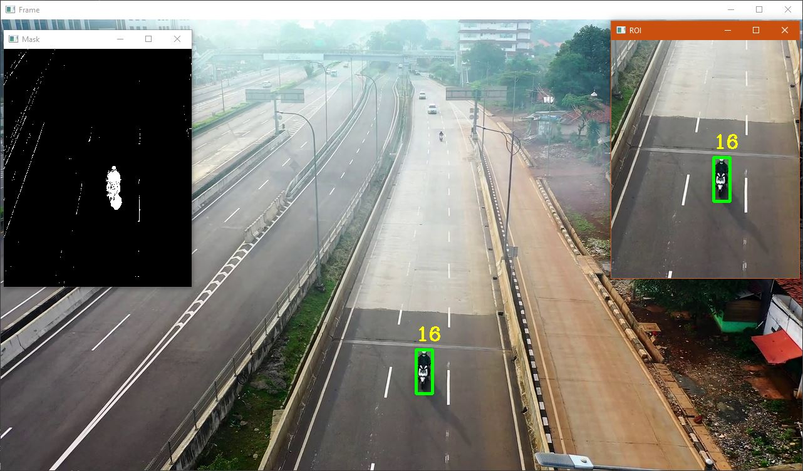
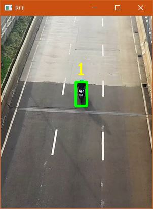
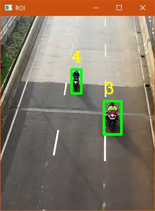
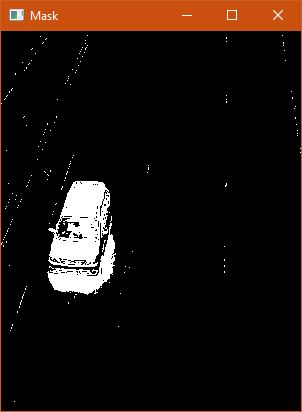
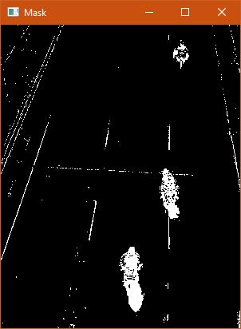
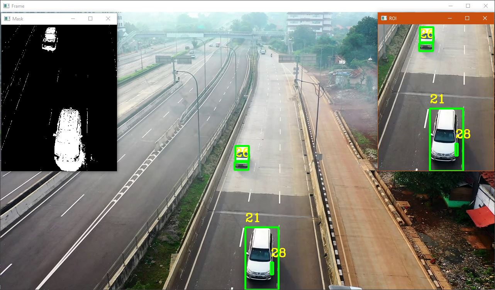

# OpenCV Car Detection Tracking
Object Detection and Tracking using OpenCV.

In this short app I have applied the basic principles of object detection and tracking using OpenCV.

These are - in a nutshell - the main bullet points that have been approached:

+ **Object Detector creation**
+ **Mask creation**
+ **Mask Thresholding (254-255)**
+ **Creation of ROI (Region of Interest)**
+ **Apply Mask to ROI**
+ **Detect Objects in ROI**
+ **Inverted Threshold to Zero**


## Contents :
Object detection and tracking has numerous applications in computer vision, thus I wanted to summarize the main challenges we face when approaching a detection and tracking app in the following table. As we give solutions to challenges via built-in functions, I have only included the main functions used and a brief description of what each one does.

| Function        |Action                                                                        |
|----------------:|------------------------------------------------------------------------------|
|cv2.threshold()   |We apply the threshold.|
|**cv2.THRESH_BINARY** | Binary Thresholding|
|**cv2.THRESH_BINARY_INV**| Inverse-Binary Thresholding|
|**cv2.THRESH_TRUNC**       |Truncate Thresholding|
|**cv2.THRESH_TOZERO** | Threshold to Zero|
|**cv2.THRESH_TOZERO_INV**|Inverted Threshold to Zero|

## Test Image used: 
I have used traffic_algo_github.mp4 that can be found in the repository.



## Region of Interest (ROI):



## Mask:


## Issues:
Several issues around the detection and tracking algorithm can be spotted if we take a closer look at some of the screenshots provided.
Most of the issues are related with:

+ Camera Instability.
+ Lighting Granularity.
+ Shade Inconsistency.
+ Poor Colour Thresholding.



## Summary:

```python
# Create object detector via a mask
object_detector = cv2.createBackgroundSubtractorMOG2()
```
```python
# Create object detector (improved with parameters)
cv2.createBackgroundSubtractorMOG2(history=100, varThreshold=10)
```
```python
# Find contours of the objects in the mask
cv2.findContours(mask,cv2.RETR_TREE,cv2.CHAIN_APPROX_SIMPLE)
```
```python
# Calculate area delimited by the contours (so we can impose a conditional later)
cv2.drawContours(roi,[cnt], -1, (0,255,0), 2)
```
```python
# Define Region of Interest (ROI)
roi = frame[340:720,500:800]
```
```python
#Apply the mask to ROI
object_detector.apply(roi)
```
```python
#Object tracking 
```
```python.

```
